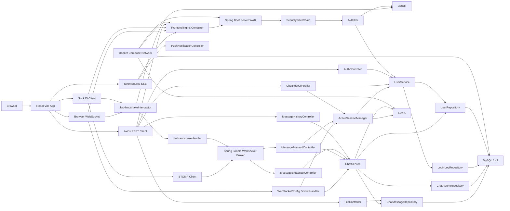
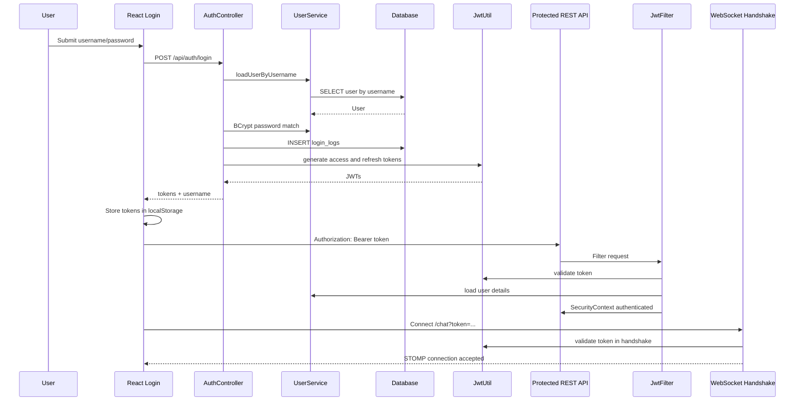
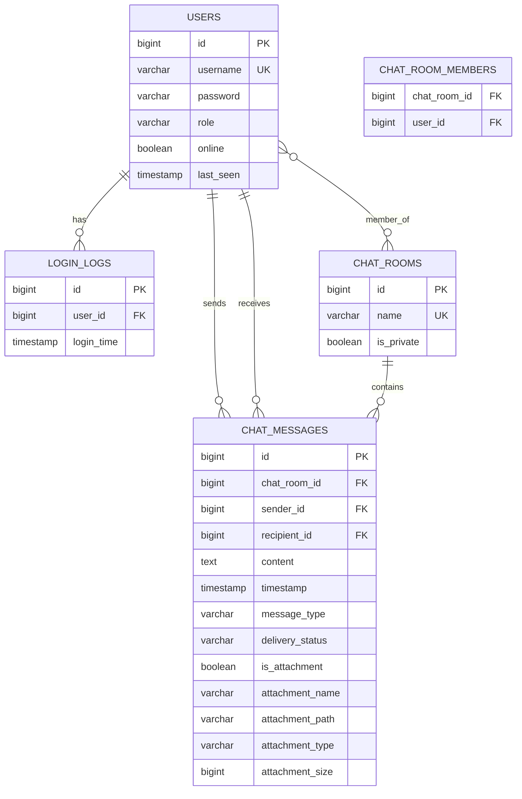

# Spring WebSocket Chat - Interview Defense Guide

This guide explains the project as you would defend it in a software engineering interview. It is based on the current codebase, not only the original README. The original README describes a smaller Spring WebSocket sample; this repository now includes Spring Boot 3.5, Java 21, JWT authentication, JPA persistence, Redis, a React/Vite frontend, Docker, legacy JSP pages, raw WebSocket, STOMP/SockJS, SSE, and a Java Swing client.

## PART 1 - Elevator Pitch

### 30 seconds

This is a real-time chat application built with Spring Boot, React, WebSocket, STOMP, SockJS, JWT authentication, JPA, MySQL/H2, and Redis. Users can register, log in, join a group chat, send private messages, see presence, receive typing indicators, upload attachments, view chat history, and receive server-sent notifications. It demonstrates both modern real-time messaging and traditional REST APIs in one system.

### 2 minutes

The project solves real-time communication. A normal REST API works well for request-response actions like login or loading message history, but chat needs the server to push new messages instantly to connected users. This application uses REST for authentication, user information, history, file upload, and search, then uses WebSocket/STOMP for live group and private messages. SockJS provides fallback transport support. Redis stores active sessions and caches message history. JPA/Hibernate persists users, chat rooms, messages, attachments, and login logs. React handles the browser UI, Axios handles REST calls, and STOMP/SockJS handles real-time communication.

### 5 minutes

The system has three major runtime areas. The frontend is a React Vite app with pages for login, home, group chat, private chat, raw WebSocket chat, and SSE notifications. It stores JWT access and refresh tokens in localStorage, attaches the access token to REST calls through Axios interceptors, refreshes expired tokens, and connects to WebSocket endpoints by passing the token as a query parameter.

The backend is a Spring Boot WAR application. It exposes authentication endpoints under `/api/auth`, user info under `/api/user/me`, chat history under `/messages`, file upload/download under `/api/files`, STOMP endpoints `/grp-chat` and `/chat`, a raw WebSocket endpoint `/web-socket`, and SSE endpoints under `/sse`. Spring Security installs a stateless JWT filter for REST authentication. A WebSocket handshake interceptor validates JWTs during WebSocket connection setup and a custom handshake handler assigns the authenticated username as the WebSocket Principal.

The database layer uses JPA entities: `User`, `LoginLog`, `ChatRoom`, and `ChatMessage`. Repositories extend `JpaRepository` and Spring Data derives SQL queries from method names. `ChatService` owns room creation, message persistence, history lookup, cache eviction, delivery status updates, and read receipts. `UserService` owns registration, password hashing with BCrypt, default user creation, login auditing, and presence persistence. Redis is used for active user tracking, WebSocket session mapping, and cached chat histories.

### Business problem

Companies need fast collaboration: support chats, team chats, classroom Q&A, trading alerts, operations dashboards, dispatch systems, or customer support. The business value is immediate delivery, presence awareness, and a better user experience than polling.

### Why not REST only?

REST is client-initiated. For chat, the client would need to poll every few seconds, wasting bandwidth and increasing latency. WebSocket keeps a single full-duplex connection open so either side can send data immediately.

### Main features

- JWT registration, login, token refresh, and logout on the client.
- Group chat over STOMP/SockJS.
- Private user-to-user chat over STOMP user queues.
- Raw WebSocket broadcast example.
- Server-Sent Events notification example.
- Online/offline presence.
- Typing indicators.
- Delivery/read receipts.
- Message history, recent messages, and search.
- File attachments with upload and download.
- React frontend and legacy JSP examples.
- Java Swing STOMP client.
- Docker Compose deployment with backend, frontend, MySQL, and Redis.

### Users

The users are authenticated chat participants. In development, default users are seeded: `Nio`, `Jason`, `Lana`, `Max`, `Joe`, `Mike`, with lowercase passwords. New users can register through React.

### Why WebSocket is required

WebSocket is required because the server must push messages, presence changes, typing events, receipts, and disconnect events in real time without waiting for each client to ask.

## PART 2 - Architecture Diagram

### Arrow explanations

- Browser to React: the user interacts with the SPA.
- React to Axios: REST calls for login, registration, user info, history, file upload, search, and token refresh.
- React to SockJS/STOMP: live group and private chat.
- React to Raw WebSocket: simple low-level WebSocket demo.
- React to EventSource: one-way server push notifications.
- Nginx to Spring Boot: Docker frontend proxies `/sample-chat` requests to backend.
- SecurityFilterChain to JwtFilter: every protected REST request is checked for `Authorization: Bearer <token>`.
- JwtFilter to JwtUtil: validates signature and expiry, extracts username.
- JwtFilter to UserService: loads user details and authorities.
- SockJS/RawWS to JwtHandshakeInterceptor: WebSocket connections pass token in query parameter.
- JwtHandshakeHandler to Broker: assigns username as WebSocket Principal.
- STOMP client to broker: clients publish to `/app/...` and subscribe to `/topic/...` or `/user/queue/...`.
- Broker to MessageBroadcastController: group messages arrive at `@MessageMapping("/grp-chat")`.
- Broker to MessageForwardController: private messages arrive at `@MessageMapping("/chat")`.
- Controllers to services: controllers coordinate HTTP/WebSocket input; services hold business logic.
- Services to repositories: persistence is delegated to Spring Data repositories.
- Repositories to MySQL/H2: JPA/Hibernate generates SQL.
- Services/ActiveSessionManager to Redis: active users, session mapping, and cached histories.

## PART 3 - Folder Structure

### Root

- `pom.xml`: parent Maven project. Defines Spring Boot parent `3.5.0`, Java `21`, modules, and common Spring WebSocket/Messaging dependencies.
- `README.md`: original project description. Useful historically, but partly stale.
- `PROJECT_ANALYSIS.md`: older analysis, currently stale because code has moved to Spring Boot 3 and React.
- `Dockerfile`: builds the backend WAR with Maven and runs it with Java 21.
- `docker-compose.yml`: runs MySQL, Redis, backend, and frontend.
- `deployment_instructions.md`: deployment guide for Render, Railway, and AWS EC2.
- `_config.yml`, `.iml`, `.idea`, `.vscode`: project/editor metadata.

### `model`

Shared DTO module. It is imported by the server and Java Swing client.

- `ChatMessage`: inbound message payload: sender, text, recipient, attachment fields.
- `OutputMessage`: outbound message payload: id, sender, content, time, my-message flag, delivery status, attachment fields.
- `TypingEvent`: typing notification payload.
- `ReceiptEvent`: delivery/read receipt payload.

### `server`

Spring Boot backend.

- `ServerApplication`: Spring Boot main class.
- `config`: Spring MVC, security, Redis, raw WebSocket, and STOMP broker configuration.
- `controller`: REST, MVC, STOMP, raw WebSocket view, file, history, auth, SSE controllers.
- `dto`: server-side API DTOs for persisted data.
- `entity`: JPA database entities.
- `repository`: Spring Data JPA repositories.
- `service`: business logic.
- `security`: JWT filter and WebSocket handshake auth.
- `listener`: WebSocket connection/disconnection events.
- `util`: JWT utility, time utility, active session manager.
- `exception`: global REST exception handling.
- `resources`: profile configuration.
- `webapp`: legacy JSP, JS, and CSS assets.
- `test`: Spring Boot tests.

### `frontend`

React Vite application.

- `src/main.jsx`: React entry point.
- `src/App.jsx`: route table.
- `src/pages`: Login, Home, GroupChat, PrivateChat, RawChat, SSE page.
- `src/components`: `EmojiPicker`.
- `src/utils/api.js`: Axios instance and token refresh interceptor.
- `src/App.css`, `src/index.css`: frontend styles.
- `Dockerfile`, `nginx.conf`: production frontend container.
- `package.json`: React, Vite, Axios, SockJS, STOMP dependencies.

### `java-web-sock-client`

Standalone desktop client.

- `Program`: Spring Boot launcher for Swing app.
- `MainFrame`: Swing UI.
- `SockJsJavaClient`: Java STOMP/SockJS client.
- `application.properties`: connection destinations.

## PART 4 - Project Flow

### User opens website

The browser loads React. `main.jsx` mounts `App`. `App.jsx` defines routes. `/` renders `Home`, which calls `/api/user/me` through Axios. If the access token is missing or invalid, React navigates to `/login`.

### User registers

`Login.jsx` sends `POST /api/auth/register` with username/password. `AuthController.register` checks required fields, calls `UserService.registerUser`, hashes the password using BCrypt, assigns role `ROLE_CHAT-USER`, and saves a `User`.

### User logs in

`Login.jsx` sends `POST /api/auth/login`. `AuthController.login` loads the user through `UserService`, verifies the password with BCrypt, logs the login in `login_logs`, generates access and refresh JWTs, and returns them.

### JWT is generated

`JwtUtil.generateAccessToken` and `generateRefreshToken` create signed JWTs with subject=username, issued-at time, expiry, and HMAC signature. Access tokens last 15 minutes; refresh tokens last 7 days.

### JWT is validated

For REST, `JwtFilter` reads the `Authorization` header. If it starts with `Bearer `, `JwtUtil.validateToken` parses and verifies the token. Then the filter loads the user and stores an authenticated `UsernamePasswordAuthenticationToken` in `SecurityContextHolder`.

For WebSocket, `JwtHandshakeInterceptor` reads `?token=...` during the handshake. If valid, it stores `username` in handshake attributes. `JwtHandshakeHandler` turns that into a `Principal`.

### React stores JWT

`Login.jsx` stores `accessToken`, `refreshToken`, and `username` in `localStorage`. `api.js` attaches the access token to future Axios requests.

### WebSocket connects

Group chat uses `new SockJS(API_BASE_URL + "/grp-chat?token=...")`. Private chat uses `/chat?token=...`. Raw chat uses `new WebSocket(.../web-socket?token=...)`.

### SockJS starts

SockJS negotiates a transport. Usually it uses native WebSocket, but it can fall back to XHR-style transports. The server endpoint has `.withSockJS()`.

### STOMP connects

The frontend creates `new Client({ webSocketFactory: () => socket })`. On connect, it subscribes to broker destinations such as `/topic/messages` or `/user/queue/messages`.

### User joins chat

On STOMP connection, Spring emits a `SessionConnectedEvent`. `WebSocketSessionListener` stores session-to-username in Redis, adds the user to `ActiveSessionManager`, marks them online, and calls `ChatService.deliverPendingMessages`.

### User sends message

Group: React publishes to `/app/grp-chat`. Spring routes it to `MessageBroadcastController.send`.

Private: React publishes to `/app/chat`. Spring routes it to `MessageForwardController.send`.

Raw: React sends text on the raw WebSocket. `WebSocketConfig.SocketHandler.handleTextMessage` receives it.

### Message reaches backend

Spring decodes JSON into the shared model DTO `spring.web.socket.chat.dto.ChatMessage`. For STOMP, `@MessageMapping` methods receive it.

### Backend validates JWT

REST validation occurs in `JwtFilter`. WebSocket authentication occurs during handshake. After connection, controller methods use the WebSocket `Principal`.

### Message is saved

`ChatService.saveMessage` resolves the sender, recipient, room, message type, initial delivery status, attachment metadata, and persists a `ChatMessage`.

### Message is broadcast

Group messages return an `OutputMessage` from a method annotated with `@SendTo("/topic/messages")`.

Private messages use `SimpMessagingTemplate.convertAndSendToUser(recipient, "/queue/messages", payload)`.

### Other user receives message

The frontend subscription callback receives JSON, parses it, and updates React state. React re-renders the message list.

### Typing indicator

Group typing publishes to `/app/grp-chat/typing` and broadcasts to `/topic/messages/typing`. Private typing publishes to `/app/chat/typing` and sends to the recipient's `/user/queue/typing`.

### Online users

`WebSocketSessionListener` updates `ActiveSessionManager` on connect/disconnect. `MessageForwardController` listens for active-user changes and publishes presence to `/topic/active`.

### File upload

React uploads file with multipart `POST /api/files/upload`. `FileController` validates extension, stores the file under `uploads`, and returns metadata. React then sends a normal chat message containing attachment metadata. The message is persisted and later downloaded through `/api/files/download/{messageId}`.

### Logout

Frontend logout removes tokens from localStorage and navigates to `/login?logout`. Because the backend is stateless, there is no server-side session to invalidate.

### Disconnect

When WebSocket disconnects, Spring emits `SessionDisconnectEvent`. `WebSocketSessionListener` removes the session from Redis and marks the user offline.

### Reconnect

The STOMP client has `reconnectDelay: 5000`, so it attempts reconnect every 5 seconds. On reconnect, the server validates the token again and updates presence.

## PART 5 - Backend Walkthrough

### Controllers

- `AuthController`: REST controller for `/api/auth/register`, `/api/auth/login`, `/api/auth/refresh`.
- `ChatRestController`: `/api/user/me`; returns authenticated username, active users, and presence list.
- `MessageHistoryController`: `/messages/group/{id}`, `/messages/private/{user1}/{user2}`, `/messages/recent`, `/messages/search?q=...`.
- `FileController`: `/api/files/upload` and `/api/files/download/{messageId}`.
- `MessageBroadcastController`: MVC routes for legacy JSP group chat plus STOMP group chat mapping `/app/grp-chat`.
- `MessageForwardController`: MVC route for legacy private chat plus STOMP private chat mapping `/app/chat`, read receipts, typing events, and active-user notification.
- `PushNotificationController`: SSE subscribe and publish endpoints.
- `BaseSecurityController`: helper superclass for reading the authenticated user.

### Services

- `UserService`: implements `UserDetailsService`. Registers users, hashes passwords, seeds defaults, logs login, updates online state, returns presence DTOs.
- `ChatService`: central chat domain service. Creates rooms, saves messages, fetches histories, searches, manages Redis cache, sends delivery and read receipts.

### Repositories

- `UserRepository`: `findByUsername`.
- `LoginLogRepository`: CRUD for login audit entries.
- `ChatRoomRepository`: `findByName`.
- `ChatMessageRepository`: derived queries for room history, recent messages, search, pending delivery, and unread/read updates.

### Entities

- `User`: username, BCrypt password, role, online, lastSeen.
- `LoginLog`: many-to-one user, login time.
- `ChatRoom`: room name, private flag, members many-to-many.
- `ChatMessage`: room, sender, recipient, content, timestamp, type, delivery status, attachment metadata.

### DTOs

- Shared model DTOs: WebSocket payloads used by backend and Java client.
- Server DTOs: REST-friendly response objects for messages, rooms, users, and presence.

### Configuration

- `SecurityConfig`: stateless JWT security, CORS, CSP, endpoint authorization, JWT filter registration.
- `WebSocketSockJsBrokerConfig`: enables STOMP broker, `/app` prefix, `/topic` and `/queue` broker destinations, SockJS endpoints.
- `WebSocketConfig`: raw WebSocket endpoint `/web-socket`.
- `RedisConfig`: RedisTemplate with String keys and JSON values.
- `SpringConfig`: legacy JSP resolver and static resource handlers.

### Exception handler

`GlobalExceptionHandler` returns JSON bodies for `IllegalArgumentException` and general exceptions.

### Important annotations

- `@SpringBootApplication`: auto-configuration, component scanning, configuration.
- `@RestController`: controller methods return JSON bodies.
- `@Controller`: MVC or WebSocket controller.
- `@Service`: business service bean.
- `@Repository`: persistence abstraction bean.
- `@Entity`: JPA mapped database object.
- `@Autowired`: dependency injection.
- `@Bean`: manually declares a Spring bean.
- `@Transactional`: wraps service methods in database transaction boundaries.
- `@MessageMapping`: STOMP message route.
- `@SendTo`: broker broadcast destination.
- `@EventListener`: listens to Spring application events.

## PART 6 - Spring Boot Concepts

### Spring Boot

Spring Boot starts from `ServerApplication.main`. It auto-configures MVC, security, JPA, Redis, WebSocket, Jackson, embedded Tomcat, and Actuator based on dependencies.

### Dependency Injection and IoC

Instead of creating dependencies with `new`, classes declare fields like `@Autowired ChatService`. The IoC container creates and wires objects. Example: `MessageForwardController` receives `SimpMessagingTemplate`, `ActiveSessionManager`, `UserService`, and `ChatService`.

### Bean lifecycle

Spring creates beans, injects dependencies, calls `@PostConstruct`, serves requests/events, then calls `@PreDestroy` on shutdown. `MessageForwardController` registers as an active-user listener in `@PostConstruct` and unregisters in `@PreDestroy`.

### Component stereotypes

- `@Component`: generic bean, used by `ActiveSessionManager`.
- `@Service`: business logic, used by `ChatService` and `UserService`.
- `@Repository`: data access, used by repository interfaces.
- `@Controller`: MVC/STOMP controller.
- `@RestController`: JSON API controller.
- `@Configuration`: bean/config class.

### Spring MVC

`@RequestMapping`, `@GetMapping`, and `@PostMapping` map HTTP requests to Java methods. JSON request bodies are deserialized by Jackson.

### Spring Security

`SecurityConfig` defines a `SecurityFilterChain`. Public endpoints include auth and WebSocket handshake paths. Protected endpoints include `/api/user/me`, `/messages/**`, and `/api/files/**`.

### JWT and filters

JWT allows stateless auth. `JwtFilter` runs once per request, validates the token, and populates the security context.

### Interceptor

`JwtHandshakeInterceptor` is not an HTTP filter; it intercepts WebSocket handshake setup before the WebSocket session is created.

### CORS

CORS controls which browser origins may call the backend. HTTP CORS is configurable; WebSocket origins are currently hardcoded to localhost in some config.

### Exception handling

`@RestControllerAdvice` centralizes error responses instead of duplicating try/catch in every controller.

### JPA and Hibernate

JPA maps Java entities to tables. Hibernate is the implementation that generates SQL, manages lazy loading, and persists changes.

### Transactions

`ChatService` is annotated `@Transactional`, so operations like creating a room and saving a message run atomically.

### Lazy loading

Most entity relationships use `FetchType.LAZY`, meaning related objects are loaded when accessed. This avoids loading entire graphs unnecessarily but requires care outside transactions.

### Thread safety and concurrent users

`ActiveSessionManager` uses Redis for shared state, `CopyOnWriteArrayList` for listeners, and an executor for asynchronous notifications. Raw WebSocket sessions use `CopyOnWriteArrayList`.

## PART 7 - WebSocket Deep Dive

WebSocket is a persistent full-duplex TCP-based protocol initiated by an HTTP upgrade request. The browser sends an HTTP request with upgrade headers; if accepted, both sides switch protocols and exchange frames.

### Frames

WebSocket data is sent in frames. A text frame can contain JSON or plain text. In this project, raw WebSocket sends plain strings, while STOMP over WebSocket sends STOMP frames containing JSON bodies.

### STOMP

STOMP is a messaging protocol layered over WebSocket. It adds commands like CONNECT, SUBSCRIBE, SEND, MESSAGE, and DISCONNECT. This gives the app semantic destinations such as `/app/chat`, `/topic/messages`, and `/user/queue/messages`.

### SockJS

SockJS provides browser compatibility and fallback transports. The server enables it with `.withSockJS()`.

### Message broker

`registry.enableSimpleBroker("/queue", "/topic")` creates an in-memory broker. `/topic` is for broadcast; `/queue` is for point-to-point user messages.

### `SimpMessagingTemplate`

Used to send messages programmatically, especially private messages and receipts. Example: `convertAndSendToUser`.

### REST vs WebSocket

REST is best for login, loading history, upload, and search. WebSocket is best for live message delivery, typing, receipts, and presence.

### Why STOMP instead of plain WebSocket?

Plain WebSocket gives only a pipe. STOMP gives routes, subscriptions, user queues, and broker semantics. This reduces custom protocol code.

## PART 8 - Security

### Authentication sequence

### BCrypt

BCrypt hashes passwords with a salt. The database stores hashes, not raw passwords.

### Roles

Users receive `ROLE_CHAT-USER`. The current code authenticates requests but does not heavily differentiate by role.

### Refresh token

When Axios receives `401`, `api.js` calls `/api/auth/refresh` with the refresh token, stores the new tokens, and retries the original request.

### WebSocket authentication

Because browser WebSocket APIs do not easily allow arbitrary auth headers in all cases, the React app sends `?token=...`. The handshake interceptor validates it.

### Security issues to defend honestly

- JWT secret is hardcoded and should move to environment config.
- Private message sending should use authenticated principal as sender, not client `from`.
- Private history and attachment download need ownership checks.
- WebSocket allowed origins are hardcoded to localhost.
- Refresh tokens are not stored server-side, so they cannot be revoked individually.

## PART 9 - Database

### ER diagram

### Tables

- `users`: identity and presence state.
- `login_logs`: audit trail for successful logins.
- `chat_rooms`: group/private room identity.
- `chat_room_members`: many-to-many user-room membership.
- `chat_messages`: normalized messages linked to room, sender, and optional recipient.

### Chat history

Group history is queried by room name or room id. Private history is stored in rooms named `private_<sortedUser1>_<sortedUser2>`. Sorting prevents duplicate rooms like `private_A_B` and `private_B_A`.

### Repositories and queries

Spring Data creates SQL from method names. Example: `findByChatRoomNameOrderByTimestampAsc` joins message to room and orders chronologically.

### Indexes

JPA creates uniqueness constraints for `users.username` and `chat_rooms.name`. For production, add explicit indexes on `chat_messages.chat_room_id`, `timestamp`, `sender_id`, `recipient_id`, `delivery_status`, and possibly full-text search on content.

## PART 10 - Frontend

### React structure

- `main.jsx`: creates React root.
- `App.jsx`: routes paths to pages.
- `Login.jsx`: register/login, stores JWTs.
- `Home.jsx`: checks auth and links to app modes.
- `GroupChat.jsx`: STOMP group chat, typing, history, file upload.
- `PrivateChat.jsx`: private STOMP chat, presence, typing, receipts, history, file upload.
- `RawChat.jsx`: raw WebSocket demo and raw history.
- `SseNotifications.jsx`: EventSource subscribe and notification publish.
- `EmojiPicker.jsx`: searchable emoji picker.
- `api.js`: Axios base URL, access token injection, refresh handling.

### State management

The app uses React local component state via `useState`, side effects via `useEffect`, and stable mutable references via `useRef`. There is no Redux or global state library.

### Routing

`BrowserRouter` maps `/login`, `/group-chat`, `/private-chat`, `/raw-chat`, `/sse-notifications`, and `/`.

### Lifecycle

WebSocket connections are created in `useEffect` and cleaned up in the returned cleanup function. Message state updates trigger re-rendering and scroll-to-bottom effects.

### Backend communication

REST uses Axios. WebSocket uses `@stomp/stompjs` and `sockjs-client`. Raw WebSocket uses the native browser `WebSocket`. SSE uses native `EventSource`.

## PART 11 - Docker

### Backend Dockerfile

Stage 1 uses Maven with Eclipse Temurin 21 to build all Maven modules. Stage 2 uses a Java 21 JRE image and runs `sample-chat.war` with `java -jar`.

### Frontend Dockerfile

Stage 1 uses Node 20 Alpine to run `npm ci` and `npm run build`. Stage 2 uses Nginx Alpine to serve `dist`.

### Docker Compose

Services:

- `db`: MySQL 8 with persisted volume.
- `redis`: Redis 7 with persisted volume.
- `backend`: Spring Boot app on port 8080.
- `frontend`: Nginx React app on port 80.

### Networking

All services are on `chat-network`. Backend reaches MySQL as `db` and Redis as `redis`. Frontend Nginx proxies `/sample-chat` to `http://backend:8080/sample-chat`.

### Production caveat

`docker-compose.yml` should set `SPRING_PROFILES_ACTIVE=prod`; otherwise the default profile may use H2 settings.

## PART 12 - Code Walkthrough

### `ServerApplication.main`

`SpringApplication.run(ServerApplication.class, args)` boots the application. `@SpringBootApplication` triggers component scanning under `spring.websocket.chat`, auto-configuration, and bean creation.

### `SecurityConfig`

Defines stateless security. CSRF is disabled because the app uses JWT instead of server sessions. CORS is configured. JWT filter is inserted before `UsernamePasswordAuthenticationFilter`. Endpoint rules decide which URLs are public and which require authentication.

### `JwtFilter`

Runs once per HTTP request. Reads the `Authorization` header, validates token, extracts username, loads user details, creates an authentication object, and sets it in `SecurityContextHolder`.

### `JwtUtil`

Creates and validates HMAC-signed JWTs. The username is stored as the token subject. Interview note: the secret should be externalized.

### `UserService`

Implements `UserDetailsService`, which Spring Security uses to load users. It also registers users, hashes passwords, creates default users, logs logins, and manages online/lastSeen fields.

### `AuthController`

Handles register, login, and refresh. It should return structured maps consistently; some error paths currently return JSON strings.

### `WebSocketSockJsBrokerConfig`

Enables STOMP messaging. `/app` messages go to application `@MessageMapping` methods. `/topic` and `/queue` are handled by the simple broker. Endpoints `/grp-chat` and `/chat` accept SockJS connections.

### `MessageBroadcastController`

For group chat, receives `/app/grp-chat`, saves a group message through `ChatService`, and broadcasts an `OutputMessage` to `/topic/messages`.

### `MessageForwardController`

For private chat, receives `/app/chat`, saves a private message, echoes to sender with `myMsg=true`, sends to recipient with `myMsg=false`, handles read receipts and typing events, and publishes active-user changes.

### `ChatService`

This is the main domain service. It creates/fetches rooms, saves messages, derives message type, manages delivery status, maps entities to DTOs, caches histories in Redis, searches content, delivers pending messages, and marks messages read.

### `WebSocketSessionListener`

Listens for STOMP connect/disconnect events. It records session id to username in Redis, marks users online/offline, and delivers pending messages.

### `FileController`

Uploads files after extension validation and returns metadata. Downloads files by message id. It needs stronger authorization checks.

### `WebSocketConfig.SocketHandler`

Demonstrates plain WebSocket. It stores connected sessions, saves raw messages, and manually loops over sessions to broadcast.

### `PushNotificationController`

Demonstrates SSE. It stores connected `SseEmitter` objects and sends named events to all emitters.

## PART 13 - Interview Questions

### Beginner

1. What does this project do? It provides authenticated real-time chat with group, private, raw WebSocket, SSE, history, presence, and files.
2. What is the backend framework? Spring Boot 3.5.
3. What is the frontend framework? React with Vite.
4. What language version does the backend use? Java 21.
5. What is Maven used for? Building the multi-module Java project and resolving dependencies.
6. What is `model` module for? Shared WebSocket DTOs used by server and Java client.
7. What is `server` module for? Spring Boot backend.
8. What is `frontend` for? Browser UI.
9. What is `java-web-sock-client` for? A desktop Swing STOMP client.
10. What is REST used for? Auth, history, user info, file upload/download, search.
11. What is WebSocket used for? Live bidirectional messaging.
12. What is SSE used for? Server-to-client notifications.
13. What is MySQL used for? Persistent production database.
14. What is H2 used for? Local/test in-memory database.
15. What is Redis used for? Active users, sessions, and history cache.
16. What is JWT? A signed token carrying the username and expiry.
17. What is BCrypt? A password hashing algorithm.
18. What is STOMP? Messaging protocol over WebSocket.
19. What is SockJS? WebSocket compatibility/fallback library.
20. What is Docker Compose? Tool to run multiple containers together.

### Intermediate

21. How does login work? React posts credentials, backend verifies BCrypt, returns JWTs.
22. How are REST requests authenticated? Axios sends Bearer token; `JwtFilter` validates it.
23. How are WebSocket requests authenticated? Token query parameter is validated during handshake.
24. Why use `SecurityContextHolder`? It stores authentication for the current request thread.
25. Why implement `UserDetailsService`? Spring Security needs it to load users.
26. How does group chat broadcast? `@MessageMapping` receives and `@SendTo` publishes to `/topic/messages`.
27. How does private chat work? `SimpMessagingTemplate.convertAndSendToUser` sends to user queue.
28. Why sort private usernames? To create one deterministic room name for a pair.
29. What is `@Transactional` doing? It keeps database operations in a single transaction.
30. What is lazy loading? Related entities load only when accessed.
31. What does `JpaRepository` provide? CRUD, pagination, sorting, and query derivation.
32. How is history cached? Redis stores serialized DTO lists with TTL.
33. How is cache invalidated? `ChatService.saveMessage` deletes relevant keys.
34. How is presence updated? WebSocket connect/disconnect events call `ActiveSessionManager`.
35. How are typing indicators sent? STOMP publishes typing events to topic or user queue.
36. How are read receipts sent? Client publishes read event; backend updates rows and sends receipt.
37. How does file upload work? Multipart REST upload stores file and returns metadata.
38. How does file download work? Message id resolves attachment path and returns resource.
39. Why have legacy JSPs? Original sample UI still exists for MVC demonstrations.
40. Why use React now? Better SPA UX and modern frontend separation.

### Advanced

41. What is a weakness in private message handling? Sender comes from client payload instead of Principal.
42. What is a weakness in private history endpoint? It lacks participant authorization checks.
43. What is a weakness in file download? It checks authentication but not message membership.
44. What is a weakness in JWT handling? Secret is hardcoded and refresh tokens are stateless.
45. What is a weakness in CORS? WebSocket origins are hardcoded in multiple configs.
46. How would you scale WebSocket horizontally? Use external broker like RabbitMQ/ActiveMQ and shared session/presence storage.
47. Is Spring's simple broker production-grade? It is fine for demos/small apps, not large multi-node systems.
48. How would you improve Redis use? Add robust key naming, TTL strategy, serialization consistency, and fallback handling.
49. How would you improve database indexes? Add indexes on room, recipient, sender, status, and timestamp.
50. How would you improve search? Use full-text index or Elasticsearch/OpenSearch.
51. How would you secure files? Store outside app root, scan content, validate MIME, enforce ownership, use signed URLs.
52. How would you revoke refresh tokens? Store token ids server-side and rotate/revoke them.
53. How would you avoid XSS? Sanitize output, avoid unsafe HTML, tighten CSP.
54. How would you protect WebSockets from abuse? Authenticate, authorize destinations, rate limit, validate payloads.
55. What is backpressure? Handling producers that send faster than consumers can process.
56. What is idempotency concern here? Reconnects or retries could duplicate sends without client message ids.
57. What happens if Redis is down? Presence/cache operations may fail; current code does not robustly degrade.
58. What happens if two messages arrive at once? Transactions and repositories persist them, but ordering relies on timestamp/id.
59. What happens if user opens two tabs? Presence may be incorrect because add/remove is username-based, not connection-count-based.
60. What is a better presence design? Track session count per user and mark offline only when count reaches zero.

### System design

61. How would you support millions of messages? Partition by room, paginate, archive, and index.
62. How would you support multiple regions? Regional WebSocket gateways, replicated storage, event streaming.
63. How would you make delivery reliable? Add message IDs, acknowledgements, retry queues, and offline delivery tables.
64. How would you handle media at scale? Object storage like S3 and CDN.
65. How would you monitor this system? Actuator, logs, metrics, tracing, WebSocket connection counts.
66. How would you deploy safely? CI/CD, migrations, health checks, rolling deploys.
67. How would you do database migrations? Flyway or Liquibase.
68. How would you test WebSocket behavior? Integration tests with STOMP client and Testcontainers.
69. How would you load test? Simulate many STOMP clients and message rates.
70. How would you separate bounded contexts? Auth, messaging, file service, presence service.

### Spring

71. Why `@SpringBootApplication`? Combines configuration, auto-config, and component scan.
72. Why `@RestController`? Returns JSON directly.
73. Why `@Controller`? Supports MVC views and STOMP controller methods.
74. Why `@Service`? Marks business logic components.
75. Why `@Repository`? Marks persistence components and exception translation.
76. Why `@Bean`? Registers manually created objects like `SecurityFilterChain`.
77. Why `@Autowired`? Lets Spring inject dependencies.
78. Why `@EventListener`? Handles WebSocket lifecycle events.
79. Why `@PostConstruct`? Runs initialization after injection.
80. Why `@PreDestroy`? Runs cleanup before bean destruction.

### React, WebSocket, Security, MySQL, Docker, Behavioral

81. Why use `useEffect` for WebSocket? Connections are side effects tied to component lifecycle.
82. Why use `useRef` for STOMP client? It persists mutable connection object without re-rendering.
83. Why use Axios interceptors? Centralized token attachment and refresh retry.
84. Why store tokens in localStorage? Simplicity, but XSS risk; httpOnly cookies can be safer.
85. Why use React Router? SPA navigation.
86. Why use STOMP subscriptions? They map server pushes to client callbacks.
87. What is `/topic/messages`? Broadcast destination.
88. What is `/user/queue/messages`? User-specific private destination.
89. Why use MySQL in prod? Durable relational storage.
90. Why use H2 in dev/test? Fast local setup.
91. Why use Docker volumes? Persist database and Redis data across container restarts.
92. Why use Docker networks? Let containers resolve each other by service name.
93. How do you explain a bug in your project? State impact, root cause, fix, and prevention.
94. How do you defend design tradeoffs? Explain constraints, alternatives, and why current choice was sufficient.
95. What would you improve first? Security authorization around sender identity, history, files, and JWT secret.
96. What did you learn from this project? Real-time architecture, Spring Security, persistence, frontend integration.
97. How do you handle criticism? Acknowledge valid points and propose concrete fixes.
98. How would you onboard a new developer? Start with flows, run locally, inspect controllers/services/entities.
99. How would you debug a missing message? Check frontend publish, WebSocket handshake, `@MessageMapping`, service save, broker subscription.
100. How would you pitch this project? It is a full-stack real-time messaging app demonstrating practical WebSocket architecture.

## PART 14 - Improvements

### Security

- Use authenticated Principal as sender for all private and group authenticated messages.
- Enforce participant authorization for private history.
- Enforce room membership/recipient checks for attachment downloads.
- Externalize JWT secret and TTLs.
- Implement refresh token rotation and revocation.
- Add server-side STOMP destination authorization.
- Replace wildcard/loose CORS defaults with environment-specific allow lists.
- Validate file MIME type, scan uploads, restrict SVG, and store files in object storage.

### Performance

- Add database indexes for chat history and delivery-status queries.
- Paginate histories instead of returning full room history.
- Use cursor pagination by timestamp/id.
- Replace simple broker with RabbitMQ/ActiveMQ for scale.
- Add message size limits and rate limiting.
- Avoid `findAll` presence scans for very large user bases.

### Scalability

- Track presence by session count, not just username set.
- Use an external STOMP broker for multi-node routing.
- Use S3/CDN for attachments.
- Add database migrations with Flyway.
- Add event streaming for message persistence/notifications if scale grows.

### Production

- Add `SPRING_PROFILES_ACTIVE=prod` to Compose backend.
- Add health checks for backend/frontend.
- Avoid exposing MySQL/Redis ports publicly in production.
- Add structured logging and tracing.
- Use Docker secrets or platform secrets for credentials.
- Add CI for frontend build, backend tests, Docker build.

### Code quality

- Prefer constructor injection over field injection.
- Return typed response DTOs instead of JSON strings.
- Add validation annotations and request DTOs.
- Add controller integration tests.
- Remove or clearly separate legacy JSP code if React is the production UI.
- Fix mojibake/encoding issues in frontend emoji/icon text.

## PART 15 - Mock Interview

We will do this interactively. I will ask one question at a time and increase difficulty.

Question 1: Explain this project in 30 seconds as if I am an interviewer who has never seen it.

Your ideal answer should mention: full-stack real-time chat, Spring Boot, React, JWT, WebSocket/STOMP/SockJS, persistence, Redis, and the main user-facing features.
